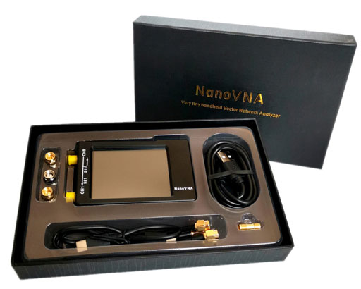

NanoVNA - Very tiny handheld Vector Network Analyzer
==========================================================
DIY的矢量网络分析仪，原项目地址[https://github.com/ttrftech/NanoVNA](https://github.com/ttrftech/NanoVNA),修改了部分电路，增加了电池管理电路，重新设计了PCB。改进了的频率算法，可以利用si5351的奇次谐波扩展支持到900MHz的测量频率，设计了金属屏蔽片，可以减少外部干扰提高测量精度，si5351直接输出的50K-300MHz频段提供优于70dB的动态。最新版本的rev3.5版本硬件可以扩展到1.5GHz以上，更多信息请参考[NanoVNA.com](https://nanovna.com/)。

We remade NanoVNA based on edy555 (https://github.com/ttrftech/NanoVNA) , but  modified some circuits, added battery management circuits, and redesigned the PCB. The improved frequency algorithm can use the odd harmonic extension of si5351 to support the measurement frequency up to 900MHz. The metal shield is designed to reduce the external interference and improve the measurement accuracy. The 50k-300MHz frequency range of the si5351 direct output provides better than 70dB dynamic. The latest version of rev3.5 hardware can be extended to above 1.5GHz. For more information, please refer to [NanoVNA.com](https://nanovna.com/) .





## 编译
## Build firmware
It is recommended to compile with gcc-arm-none-eabi 8, and exceptions may occur with other versions of the compiler.
Please sync the CibiOS submodule before compiling.

```
$ git submodule update --init --recursive
```


### MacOSX

Install cross tools and firmware updating tool.

```
$ brew tap px4/px4
$ brew install gcc-arm-none-eabi-80
$ brew install dfu-util

```

### Linux

Download arm cross tools from [here](https://developer.arm.com/tools-and-software/open-source-software/developer-tools/gnu-toolchain/gnu-rm/downloads).

```
$ wget https://developer.arm.com/-/media/Files/downloads/gnu-rm/8-2018q4/gcc-arm-none-eabi-8-2018-q4-major-linux.tar.bz2
$ sudo tar xfj -C /usr/local gcc-arm-none-eabi-8-2018-q4-major-linux.tar.bz2
$ PATH=/usr/local/gcc-arm-none-eabi-8-2018-q4-major/bin:$PATH
$ sudo apt install -y dfu-util
```

```
$ make
```


### Windows
Follow [these instructions](https://gnu-mcu-eclipse.github.io/install/)to install gnu-mcu-eclipse.

Existing Code as Makefile Projiect.
Project > Properties > C/C++ Build > Setting:
Confirm that Toolchains is "GNU MCU Eclipse ARM Embedded GCC (arm-none-eabi-gcc)"

Project > Properties > C/C++ Build > Tool Chain Editor:
```
Current toolchain: ARM Cross GCC
Current builder: Gnu Make Builder
```

 Build Project.


当前版本源码基于**[DiSlord](https://github.com/DiSlord)**的源码修改，如果编译失败，请参考[NanoVNA-D](https://github.com/DiSlord/NanoVNA-D)的说明

The source code of the current version is based on the source code modification of **[DiSlord](https://github.com/DiSlord)**. If the compilation fails, please refer to [NanoVNA-D](https://github.com/DiSlord/NanoVNA-D) Description

https://github.com/DiSlord/NanoVNA-D/issues/1#issuecomment-698945620


### Debug use  Eclipse + cmsis-dap +openocd
Debugger Configurations > GBD OpenOCD Debugging, Double click to create a new setting, Select “Debugger“ label, add  config option.
```
-f NanoVNA_DAP.cfg
```


感谢[edy555](https://github.com/edy555)创建了这个项目，所有软件版权归edy555所有。
 Thanks to [edy555](https://github.com/edy555) for creating this project, all software copyrights are owned by edy555
[https://github.com/ttrftech/NanoVNA](https://github.com/ttrftech/NanoVNA)；

感谢[cho45](https://github.com/cho45)对项目做出重大改进。
Thanks to cho45 for making major improvements to the project. [https://github.com/cho45/NanoVNA](https://github.com/cho45/NanoVNA) 

感谢[DiSlord](https://github.com/DiSlord)对项目的持续改进。
Thanks to [DiSlord](https://github.com/DiSlord) for continuous improvement of the project https://github.com/DiSlord/NanoVNA-D.

以下为原项目自述
==========================================================
The following is the original project readme
==========================================================
# About

NanoVNA is very tiny handheld Vector Network Analyzer (VNA). It is standalone with lcd display, portable device with battery. This project aim to provide an RF gadget but useful instrument for enthusiast.

This repository contains source of NanoVNA firmware.

## [](https://github.com/ttrftech/NanoVNA#prepare-arm-cross-tools)Prepare ARM Cross Tools

**UPDATE**: Recent gcc version works to build NanoVNA, no need old version.

### [](https://github.com/ttrftech/NanoVNA#macosx)MacOSX

Install cross tools and firmware updating tool.

```
$ brew tap px4/px4
$ brew install gcc-arm-none-eabi-80
$ brew install dfu-util

```

### [](https://github.com/ttrftech/NanoVNA#linux-ubuntu)Linux (ubuntu)

Download arm cross tools from [here](https://developer.arm.com/tools-and-software/open-source-software/developer-tools/gnu-toolchain/gnu-rm/downloads).

```
$ wget https://developer.arm.com/-/media/Files/downloads/gnu-rm/8-2018q4/gcc-arm-none-eabi-8-2018-q4-major-linux.tar.bz2
$ sudo tar xfj -C /usr/local gcc-arm-none-eabi-8-2018-q4-major-linux.tar.bz2
$ PATH=/usr/local/gcc-arm-none-eabi-8-2018-q4-major/bin:$PATH
$ sudo apt install -y dfu-util

```

## [](https://github.com/ttrftech/NanoVNA#fetch-source-code)Fetch source code

Fetch source and submodule.

```
$ git clone https://github.com/ttrftech/NanoVNA.git
$ cd NanoVNA
$ git submodule update --init --recursive

```

## [](https://github.com/ttrftech/NanoVNA#build)Build

Just make in the directory.

```
$ make

```

### [](https://github.com/ttrftech/NanoVNA#build-firmware-using-docker)Build firmware using docker

Using [this docker image](https://cloud.docker.com/u/edy555/repository/docker/edy555/arm-embedded) without installing arm toolchain.

```
$ cd NanoVNA
$ docker run -it --rm -v $(PWD):/work edy555/arm-embedded:8.2 make

```

## [](https://github.com/ttrftech/NanoVNA#flash-firmware)Flash firmware

First, make device enter DFU mode by one of following methods.

*   Jumper BOOT0 pin at powering device
*   Select menu Config->DFU (needs recent firmware)

Then, flash firmware using dfu-util via USB.

```
$ dfu-util -d 0483:df11 -a 0 -s 0x08000000:leave -D build/ch.bin

```

Or simply use make.

```
$ make flash

```

## [](https://github.com/ttrftech/NanoVNA#control-from-pc)Control from PC

See [python directory](https://github.com/ttrftech/NanoVNA/blob/master/python/README.md).

## [](https://github.com/ttrftech/NanoVNA#note)Note

Hardware design material is disclosed to prevent bad quality clone. Please let me know if you would have your own unit.

## [](https://github.com/ttrftech/NanoVNA#reference)Reference

*   [Schematics](https://github.com/ttrftech/NanoVNA/blob/master/doc/nanovna-sch.pdf)
*   [PCB Photo](https://github.com/ttrftech/NanoVNA/blob/master/doc/nanovna-pcb-photo.jpg)
*   [Block Diagram](https://github.com/ttrftech/NanoVNA/blob/master/doc/nanovna-blockdiagram.png)
*   Kit available from [https://ttrf.tk/kit/nanovna](https://ttrf.tk/kit/nanovna)

## [](https://github.com/ttrftech/NanoVNA#credit)Credit

*   [@edy555](https://github.com/edy555)

### [](https://github.com/ttrftech/NanoVNA#contributors)Contributors

*   [@hugen79](https://github.com/hugen79)
*   [@cho45](https://github.com/cho45)
