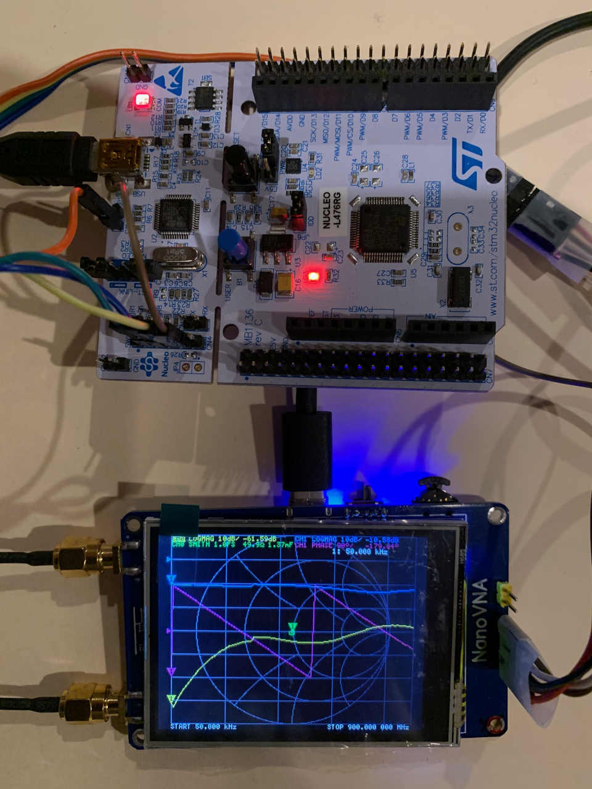

NanoVNA - Very tiny handheld Vector Network Analyzer
==========================================================

# About

This is my attemp to port the STM32F303CCT6 to this popular NanoVNA project.  The benefits are larger SRAM 40KB from 16KB, larger flash 256KB from 128KB, faster CPU clock 72MHz from 48MHz, and floating point accelerator.  For detail information, please refer to the original project page by edy555.

https://github.com/ttrftech/NanoVNA

# Preparation

Please refer to original NanoVNA page for detail preparation information.

The current test board has the MCU STM32F072CBT6 replaced by STM32F303CCT6.  Also, the USB_DP pin has a 1.5K ohm pull up resistor connected to VDD (3.3V), and the USB_DP (PA12) is shorted with PA10.  AT power-up, PA10 will pull down USB_DP then release to inform host a device is plugged in.  Another way is to connect USB_DP to PA10 directly and use PA10 to control USB connect and disconnect.

Because edy555's ChibiOS/os/hal/ports/STM32/LLD/ADCv3/hal_adc_lld.c is not updated with ADCv3 protocol, I modified and name it as hal_adc_lld.c.fixed.  To put the file at the correct location, do the following.  I will find a nicer way to handle it later.

    $ cp hal_adc_lld.c.fixed ./ChibiOS/os/hal/ports/STM32/LLD/ADCv3/hal_adc_lld.c

# Compile

To compile for STM32F303CCT6, add TARGET=F303

    $ make TARGET=F303

Since F303 doesn't support crystal-less DFU, a separate ST_Link is required to flash the firmware.  Users need to solder the pins on the NanoVNA SWD port.

To flash firmware at Linux, refer to

https://github.com/texane/stlink

The flash firmware command at Linux(Ubuntu) is

    $ st-flash write build/ch.bin 0x8000000

At Ubuntu, the shell can be accessed via

    $ sudo screen /dev/ttyACM0 57600

# Hardware mod candidates:

- Add D2 Schottky diode to measure the battery voltage.  Easy.
- Add another 220nF cap parallel to C38 to solve the tlv320aic3204 fail-to-start issue.  Easy.
- Replace STM32F072CBT6 to STM32F303CCT6.  Add 1.5K resistor between VDD and USB_DP.  Short USB_DP (PA12) and PA10.  Harder.
- Add 8MHz chrystal to PCB.  Better with PCB revision.

# Status

Most of functions are working, except DFU via manu.

# Credit

Thanks [@edy555](https://github.com/edy555) for creating this tiny feature rich gadget.  edy555 is also working on the F303 version of NanoVNA plus other new features, probably named NanoVNA-V2.

Thanks [@hugen79](https://github.com/hugen79) for providing the hardware for my porting work and debugging support.  